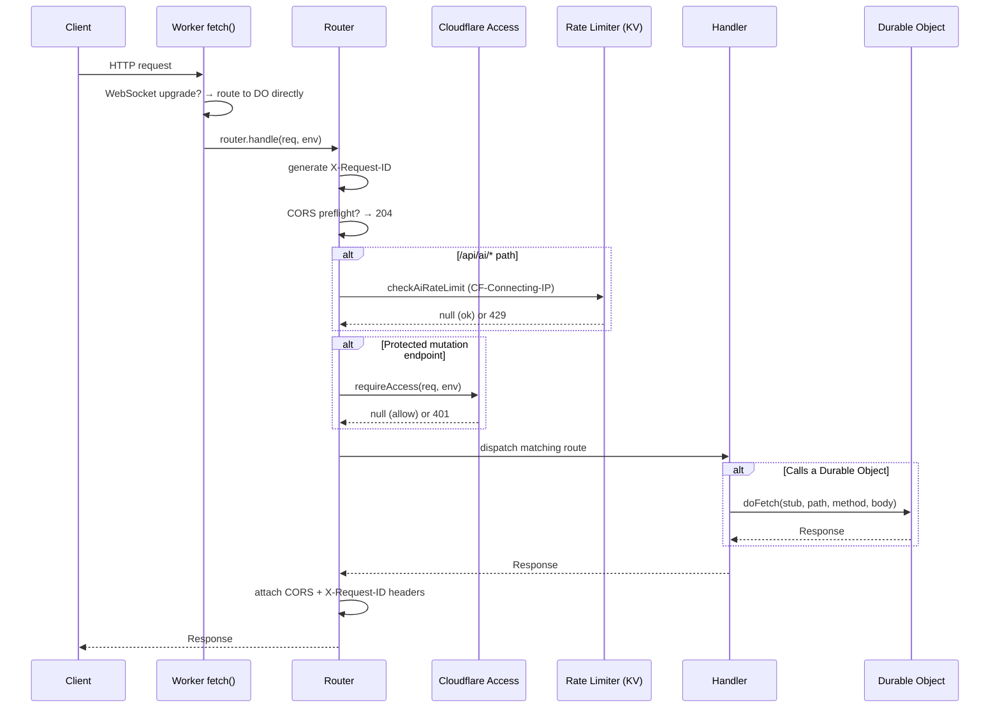
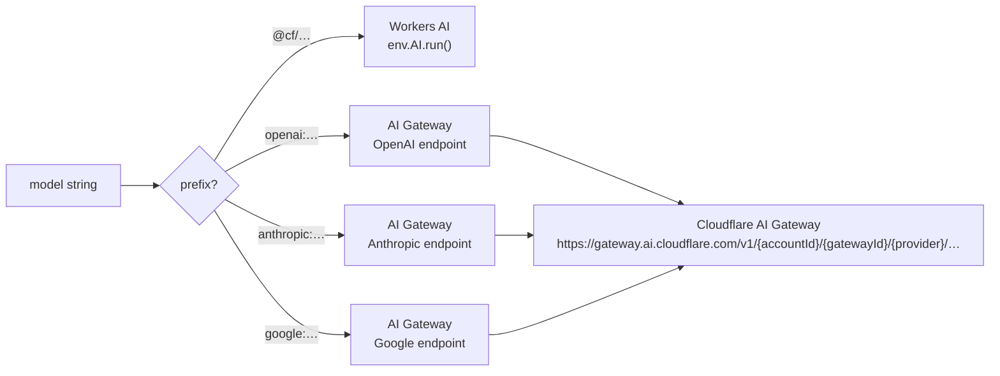
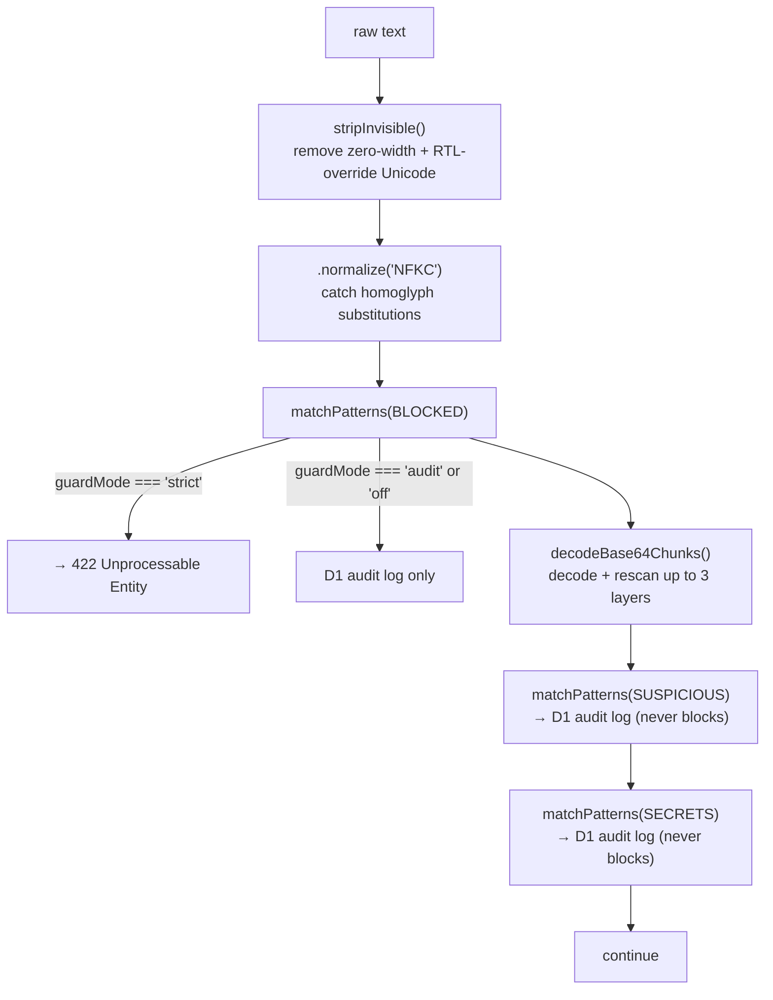
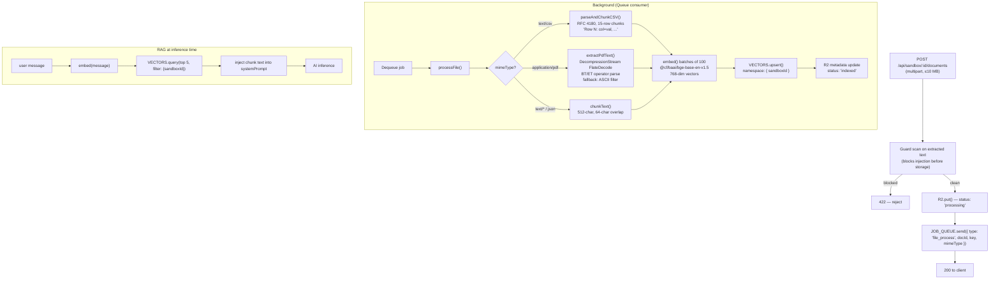
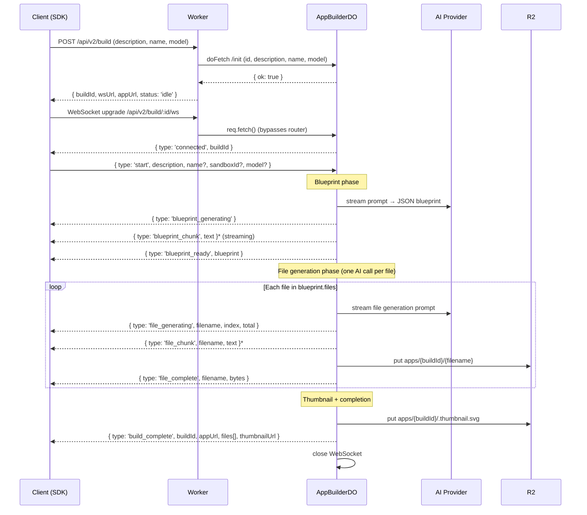

# Architecture — Project Whisper

## Table of Contents

1. [Design Philosophy](#1-design-philosophy)
2. [System Topology](#2-system-topology)
3. [Worker Entry Point](#3-worker-entry-point)
4. [Request Lifecycle](#4-request-lifecycle)
5. [Router](#5-router)
6. [AI Routing](#6-ai-routing)
7. [Durable Objects](#7-durable-objects)
   - [SandboxDO](#sandboxdo)
   - [AppBuilderDO](#appbuilderdo)
   - [AppStateDO](#appstatedo)
8. [Data Stores](#8-data-stores)
9. [Security Subsystem](#9-security-subsystem)
10. [Documents and RAG Pipeline](#10-documents-and-rag-pipeline)
11. [App Builder Pipeline](#11-app-builder-pipeline)
12. [SDK and Public Assets](#12-sdk-and-public-assets)
13. [Key Design Decisions](#13-key-design-decisions)
14. [Storage Key Reference](#14-storage-key-reference)

---

## 1. Design Philosophy

Project Whisper is built around three immovable constraints:

**Zero runtime npm dependencies.** Nothing is imported from npm at runtime. HTTP routing, streaming, request parsing, cryptography, and serialisation all use native Web Platform APIs — `URLPattern`, `ReadableStream`, `DecompressionStream`, `crypto.subtle`, `TextEncoder`, `Intl.*`. This eliminates supply-chain risk, keeps cold-start times minimal, and ensures the entire runtime fits inside a single Cloudflare Worker bundle.

**Cloudflare-native infrastructure only.** Every storage, compute, and messaging primitive is a Cloudflare product (Workers, Durable Objects, KV, R2, D1, Queues, Vectorize, Analytics Engine, Email Routing, AI, Pages). There are no external database connections, no Redis, no third-party message brokers.

**Correctness as a type-level invariant.** TypeScript with `strict: true` is the only test gate. All request parsing is centralised in `src/lib/schema.ts`; all route handlers use `parseBody(req, parser)` and never call `req.json()` directly. A green `npx tsc --noEmit` is the required pre-commit check.

---

## 2. System Topology

```mermaid
graph TB
    subgraph Client
        Browser["Browser / SDK"]
    end

    subgraph Cloudflare["Cloudflare Edge"]
        Worker["Worker (src/index.ts)"]
        Assets["Static Assets\n(public/)"]

        subgraph DOs["Durable Objects"]
            SandboxDO["SandboxDO\n(per sandbox UUID)"]
            AppBuilderDO["AppBuilderDO\n(per build UUID)"]
            AppStateDO["AppStateDO\n(per build UUID)"]
        end

        subgraph Storage["Storage & Data"]
            KV["KV\nSANDBOX_REGISTRY\n(sandbox list + rate limits)"]
            D1["D1 (DB)\naudit log + metrics"]
            R2["R2 (FILES)\ndocuments + build files + images"]
            Vectorize["Vectorize (VECTORS)\nRAG embeddings (768-dim)"]
            Analytics["Analytics Engine\ntime-series telemetry"]
        end

        subgraph Async["Async"]
            Queue["Queues (JOB_QUEUE)\nfile_process + embedding_batch"]
        end

        subgraph AI["AI"]
            WorkersAI["Workers AI\n(@cf/* models)"]
            Gateway["AI Gateway\nOpenAI / Anthropic / Google"]
        end

        subgraph Email["Email"]
            EmailRouting["Email Routing\n(SEND_EMAIL binding)"]
        end

        subgraph Pages["Pages (optional)"]
            PagesProject["Cloudflare Pages\ndeploy target"]
        end
    end

    Browser -->|"HTTPS"| Worker
    Browser -->|"static"| Assets
    Worker -->|"WebSocket upgrade"| SandboxDO
    Worker -->|"WebSocket upgrade"| AppBuilderDO
    Worker -->|"HTTP RPC"| SandboxDO
    Worker -->|"HTTP RPC"| AppBuilderDO
    Worker -->|"HTTP RPC"| AppStateDO
    Worker -->|"KV put/get/list"| KV
    Worker -->|"SQL"| D1
    Worker -->|"get/put/delete/list"| R2
    Worker -->|"enqueue"| Queue
    Queue -->|"consume"| Worker
    Worker -->|"embed + upsert"| Vectorize
    Worker -->|"writeDataPoint"| Analytics
    Worker -->|"@cf/* inference"| WorkersAI
    Worker -->|"fetch()"| Gateway
    Worker -->|"SEND_EMAIL.send()"| EmailRouting
    Worker -->|"Pages Direct Upload API"| PagesProject
    SandboxDO -->|"@cf/* inference"| WorkersAI
    SandboxDO -->|"fetch() AI Gateway"| Gateway
    SandboxDO -->|"KV"| KV
    SandboxDO -->|"D1"| D1
    SandboxDO -->|"Vectorize query"| Vectorize
    AppBuilderDO -->|"@cf/* inference"| WorkersAI
    AppBuilderDO -->|"fetch() AI Gateway"| Gateway
    AppBuilderDO -->|"R2 put"| R2
```



### Binding summary

| Binding | Type | Purpose |
|---------|------|---------|
| `AI` | Workers AI | `@cf/*` model inference |
| `SANDBOX` | Durable Object | One `SandboxDO` instance per sandbox UUID |
| `APP_BUILDER` | Durable Object | One `AppBuilderDO` instance per build UUID |
| `APP_STATE` | Durable Object | One `AppStateDO` instance per build UUID |
| `SANDBOX_REGISTRY` | KV Namespace | Sandbox metadata list + sliding-window rate limit state |
| `DB` | D1 Database | Audit log (`sandbox_events`) + usage metrics (`usage_metrics`) |
| `FILES` | R2 Bucket | Documents, generated app files, images, thumbnails |
| `JOB_QUEUE` | Queue | Background `file_process` + `embedding_batch` jobs |
| `VECTORS` | Vectorize | 768-dimension cosine-similarity index for RAG |
| `ANALYTICS` | Analytics Engine | Time-series telemetry (optional) |
| `SEND_EMAIL` | Email Routing | Outbound email from generated apps (optional) |

---

## 3. Worker Entry Point

`src/index.ts` is the single Worker export. It has two handlers:

**`fetch(req, env, ctx)`** — the HTTP handler. Before invoking the router, it checks whether the request is a WebSocket upgrade (`Upgrade: websocket`). WebSocket requests must bypass the HTTP router because the Cloudflare runtime delivers them directly to a Durable Object:

```
GET /api/sandbox/:id/ws  → env.SANDBOX.get(idFromName(id)).fetch(req)
GET /api/v2/build/:id/ws → env.APP_BUILDER.get(idFromName(id)).fetch(req)
```

All other requests go to `router.handle(req, env)`.

**`queue(batch, env)`** — the Queue consumer. Processes `file_process` and `embedding_batch` jobs one at a time. On success, calls `msg.ack()`; on error, calls `msg.retry()` (up to 3 retries per `wrangler.toml`).

Route groups are mounted from individual route files using a simple spread into `router.on()`:

```typescript
for (const [method, path, handler] of [...aiRoutes, ...sandboxRoutes, ...vibeRoutes, ...])
  router.on(method, path, handler)
```

---

## 4. Request Lifecycle



Every response from the router carries:
- `X-Request-ID: <uuid>` — per-request traceability
- `Access-Control-Allow-Origin` / `Access-Control-Allow-Methods: GET, POST, PUT, DELETE, PATCH, OPTIONS` — origin-aware CORS (`ALLOWED_ORIGINS` env var, defaults to `*`)

---

## 5. Router

`src/lib/http.ts` implements a zero-dep `URLPattern`-based router:

```typescript
class Router {
  on(method, path, handler): this
  get/post/put/delete/patch(path, handler): this  // shortcut methods
  handle(req, env): Promise<Response>
}
```

`handle()` runs in this order:
1. Generate `X-Request-ID`
2. Build CORS headers from `ALLOWED_ORIGINS` env var (or `*`)
3. Return 204 on `OPTIONS` preflight
4. Call `checkAiRateLimit()` for `/api/ai/*` paths
5. Call `requireAccess()` for protected mutation paths
6. Iterate routes; first match wins; 404 if no match

**`parseBody<T>(req, parser)`** is the canonical way to handle JSON request bodies. It reads the body (enforcing `MAX_REQUEST_BODY = 1 MB`), passes it through a typed parser function from `schema.ts`, and returns `{ ok: true, data }` or `{ ok: false, response }` (with 400/422 already set). No handler ever calls `req.json()` directly.

**`checkRateLimit(key, max, windowMs, env, message?)`** is a generic KV-backed sliding-window rate limiter used by both the AI rate limiter and the per-app email limiter.

---

## 6. AI Routing

`src/lib/ai.ts` dispatches inference based on the model string prefix:



All providers return streaming via normalised SSE (`data: {"response":"…"}\n\n`). The `streamSSEFetch` helper normalises provider-specific delta formats (OpenAI `choices[0].delta.content`, Anthropic `content_block_delta`, Google `candidates[0].content.parts[0].text`) into a single `ReadableStream<Uint8Array>` that `sseResponse()` can serve directly.

Special capabilities routed through `ai.ts`:
- **Tool use** — Anthropic `tool_use` blocks / OpenAI `tool_calls` normalised into `{ type: 'tool_call', calls: [{id, name, input}] }` JSON
- **Extended thinking** — Anthropic `thinking` content blocks are passed through for the `/api/ai/think` endpoint
- **Structured output** — `responseFormat: 'json'` enables JSON mode per provider
- **Search grounding** — `groundingEnabled: true` activates Google Search grounding on compatible Google models
- **Image generation** — `env.AI.run('@cf/stabilityai/stable-diffusion-xl-base-1.0', ...)`, returns base64 PNG
- **Audio transcription** — `env.AI.run('@cf/openai/whisper', ...)`
- **Embeddings** — `env.AI.run('@cf/baai/bge-base-en-v1.5', ...)`, 768-dimensional vectors, batched in groups of 100

---

## 7. Durable Objects

All three DOs follow the same addressing convention: always `idFromName(logicalId)` — never a generated DO ID. This makes the address deterministic and predictable from any Worker.

```typescript
// Canonical DO call pattern used in all route files
export async function doFetch(s: DurableObjectStub, path: string, method: string, body?: unknown) {
  return s.fetch(`https://do/${path}`, {
    method,
    headers: { 'Content-Type': 'application/json' },
    body: body !== undefined ? JSON.stringify(body) : undefined,
  })
}
```

### SandboxDO

`src/durable/SandboxDO.ts` — one instance per sandbox UUID. Stores everything in a single `SandboxConfig` record under the key `'config'`:

```typescript
interface SandboxConfig {
  id, name, description, systemPrompt, tools,
  model, temperature, maxTokens,
  memory: Message[],         // capped at MAX_MESSAGES = 100
  createdAt, updatedAt,
  integrityHash?,            // SHA-256 config fingerprint
  guardMode?,                // 'strict' | 'audit' | 'off'
  ragEnabled?, appHtml?
}
```

**Endpoints handled inside the DO:**

| Path | Method | Action |
|------|--------|--------|
| `init` | POST | Initialise config from `CreateSandboxRequest` |
| `config` | GET | Return config (recompute + verify integrity hash) |
| `config` | PATCH | Partial update; re-run guard scan on systemPrompt |
| `run` | POST | Blocking inference: guard → optional RAG inject → AI call → guard outbound → store in memory → D1 metrics |
| `stream` | POST | SSE streaming inference (same pipeline, chunks relayed) |
| `history` | GET | Return `memory` array for a sessionId |
| `history/:sessionId` | GET | Same, explicit session |
| `export` | GET | Serialise config as `SandboxExport`; optionally sign with HMAC |
| `fingerprint` | GET | Return current integrity hash + tampered flag |
| `metrics` | GET | Aggregate `usage_metrics` rows from D1 |
| `/` | DELETE | Delete from D1 + KV; return confirmation |

**Session memory** — each `sessionId` gets an independent `Message[]` stored under `session:{sessionId}`. Omitting `sessionId` uses `'default'`. Capped at `MAX_SESSIONS_PER_SANDBOX = 100` sessions; `MAX_MESSAGES = 100` per session.

**Per-sandbox rate limit** — a sliding-window counter under `RL_STORAGE_KEY = 'rlState'` (stored separately from config so it survives DO hibernation). 20 calls per 60 s for `run` and `stream`.

**WebSocket endpoint** (`GET /api/sandbox/:id/ws`) — bidirectional, supports tool-call round-trips:

```
Client → Server: plain UTF-8 message text
                 AiClient.encodeToolResult(toolUseId, toolName, content)
Server → Client: streaming token string
                 { type: 'tool_call', calls: [{id, name, input}] }
                 { type: 'done', reply: '...' }
                 { type: 'error', message: '...' }
```

### AppBuilderDO

`src/durable/AppBuilderDO.ts` — one instance per build UUID. Runs a phased, WebSocket-driven multi-file code generation pipeline. State stored under `'state'` as `BuildState`.

See [Section 11](#11-app-builder-pipeline) for the full pipeline.

**WebSocket endpoint** (`GET /api/v2/build/:id/ws`) — client sends `{ type: 'start', description, name?, sandboxId?, model? }`, server streams back progress events through five phases. The Worker routes this directly before the HTTP router sees it.

### AppStateDO

`src/durable/AppStateDO.ts` — one instance per build UUID. Provides a string key-value store for generated apps, backed by Durable Object storage.

**Key constraints:** characters must match `^[a-zA-Z0-9._\-/]+$`; max 512 chars. Value max 16 384 chars.

**Endpoints handled inside the DO:**

| Path | Method | Action |
|------|--------|--------|
| `/kv` | GET | `storage.list()` → return all `{ key, value }` pairs |
| `/kv/:key` | GET | `storage.get(key)` → `{ key, value }` or 404 |
| `/kv/:key` | PUT | Validate key + value, `storage.put(key, value)` |
| `/kv/:key` | DELETE | `storage.delete(key)` |
| `/` | DELETE | `storage.deleteAll()` |

The route handlers in `appstate.ts` validate the `id` parameter is a UUID before calling the DO stub — preventing path traversal via the R2/DO addressing.

---

## 8. Data Stores

### KV — `SANDBOX_REGISTRY`

Used for two purposes:

**Sandbox metadata list** — each sandbox is stored on the key itself (not the value):

```
key:   sandbox:{uuid}
value: the uuid string (trivial — data lives in key metadata)
metadata: { id, name, description, model, createdAt, fromVibe }
expirationTtl: 604800 (7 days)
```

This KV metadata pattern means `list()` returns all sandbox metadata in a single call with zero N+1 fetches. The value is redundant but required by the KV API.

**Sliding-window rate limit state** — timestamp arrays under:
```
rl:ai:{CF-Connecting-IP}   → number[] (AI route limiter, 30 req/60 s)
rl:email:{buildId}         → number[] (email limiter, 5/60 s per app)
```

### D1 — `DB`

Audit log and usage metrics. Two tables:

```sql
-- Append-only audit log
sandbox_events (id, sandbox_id, event_type, metadata JSON, created_at, request_id)
-- event_type: 'guard_flag' | 'response_flag' | 'sandbox_deleted' | 'vibe_created' | 'csp_violation'

-- Per-inference usage rows (aggregated at query time)
usage_metrics (id, sandbox_id, model, tokens_in, tokens_out, latency_ms, created_at)
```

`GET /api/sandbox/:id/metrics` aggregates `usage_metrics` rows at query time (no materialised view). CSP violations are written by `POST /api/csp-report` with no authentication required.

### R2 — `FILES`

All binary data. Key namespace is path-structured:

| Prefix | Contents |
|--------|----------|
| `sandboxes/{sandboxId}/documents/{docId}` | Uploaded documents (PDF, CSV, text, etc.) |
| `apps/{buildId}/{filename}` | Generated app files (`index.html`, `app.js`, etc.) |
| `apps/{buildId}/.thumbnail.svg` | SVG metadata thumbnail (dot-prefix hides from `list()`) |
| `apps/{buildId}/images/{imageId}` | R2-backed images uploaded by generated apps |

R2 objects use `customMetadata` to store structured metadata (document status, image name/size/contentType/uploadedAt) that can be read back without re-reading the object body.

### Vectorize — `VECTORS`

768-dimensional cosine-similarity index. Namespace (metadata filter) per sandbox: all vectors for sandbox `S` are stored with `{ sandboxId: S }` as metadata, enabling scoped query without a separate index per sandbox.

Vector ID format: `{docId}-{chunkIndex}` (e.g. `abc123-0`, `abc123-1`).

At RAG inference time: embed the user message → query top 5 vectors with `filter: { sandboxId }` → inject matching chunk text into the system prompt.

### Analytics Engine — `ANALYTICS`

Optional time-series telemetry. `writeDataPoint()` is called for inference events. Available in Cloudflare's Analytics dashboard. No aggregation logic in-process — purely append-only writes.

---

## 9. Security Subsystem

### Guard pipeline

`src/lib/guard.ts` — `scan(text): ScanResult`. Stateless; called on user messages, system prompts, transcribed audio, and extracted document text.



Pattern tables:
- `BLOCKED`: `ignore_instructions`, `new_instructions`, `jailbreak_dan`, `prompt_override`, `forget_training`
- `SUSPICIOUS`: `role_switch`, `act_as`, `reveal_prompt`, `role_delimiter`, `llm_tag`, `jinja_template`, `prompt_leak`
- `SECRETS`: `openai_key`, `aws_key`, `github_token`, `anthropic_key`

Guard is also applied to outbound model replies (response flag) and to document text during the RAG indexing pipeline before vectors are stored.

### Integrity hashing

`src/lib/integrity.ts` — `computeConfigHash(config): Promise<string>`. SHA-256 over:

```
id + name + systemPrompt + model + temperature + maxTokens + memory.length
```

`memory.length` (thread-length salt) changes on every turn, so the hash changes every message. Stored on the config object; recomputed on `GET config`. If stored ≠ recomputed, `tampered: true` is returned — indicating out-of-band modification to the DO's storage.

### HMAC export signing

When `SIGNING_SECRET` is set, `exportConfig` appends a `signature` field: hex HMAC-SHA256 over a canonical JSON string with fixed field order (`version, name, description, systemPrompt, tools, model, temperature, maxTokens`). `importConfig` rejects with 422 if the signature is absent or invalid. Provides export provenance without requiring full PKI.

### Rate limiting

Three independent layers, all sliding-window, all KV-backed:

| Layer | Key | Limit | Applied at |
|-------|-----|-------|-----------|
| Per-IP AI routes | `rl:ai:{ip}` | 30 req / 60 s | `Router.handle()` before dispatch |
| Per-sandbox run/stream | `rlState` in DO storage | 20 req / 60 s | `SandboxDO.handleRun/handleStream` |
| Per-app email | `rl:email:{buildId}` | 5 / 60 s | `sendEmailHandler` in appstate.ts |

All three use the same `checkRateLimit(key, max, windowMs, env)` implementation from `http.ts` (or its in-DO equivalent).

### Cloudflare Access

`src/lib/access.ts` — zero-dependency RS256 JWT validator using the Web Crypto API. When `CF_ACCESS_AUD` and `CF_ACCESS_TEAM_DOMAIN` are set:

```
requireAccess(req, env)
  → fetch JWKS from https://{teamDomain}/cdn-cgi/access/certs
  → validate RS256 signature, audience, and expiry
  → token resolution: Cf-Access-Jwt-Assertion header → Authorization: Bearer
  → return null (allow) or 401 Response
```

JWKS is module-scope cached for 1 hour. `isProtectedRequest(method, pathname)` is a pure boolean function — it is called once per request in `Router.handle()` before dispatch. When `CF_ACCESS_AUD` is not set, `requireAccess` is a no-op returning `null`.

Protected paths (all state-mutation, none of the read/inference paths):
- `POST/PATCH/DELETE /api/sandbox/*`
- `POST/DELETE /api/v2/build/*`
- `PUT/DELETE /api/app/:id/state*`
- `DELETE /api/app/:id/images/:imageId`
- `POST /api/vibes`

### CSP and secure headers

Every HTML page response goes through `htmlHeaders(nonce, allowFrame)` in `pages.ts`:
- `Content-Security-Policy: script-src 'nonce-{nonce}'` — no `unsafe-inline` on first-party pages
- `Content-Security-Policy-Report-Only` — same policy + `report-uri /api/csp-report`
- `X-Content-Type-Options: nosniff`
- `Referrer-Policy: strict-origin`
- `X-Frame-Options: DENY` (omitted when `allowFrame=true` for embed pages)

Generated apps (`/build/:id`) use a separate, permissive `BUILD_CSP` that allows `unsafe-inline`, `unsafe-eval`, and CDN origins (`esm.sh`, `unpkg.com`, `cdn.jsdelivr.net`) because AI-generated code uses inline scripts and CDN ESM imports.

---

## 10. Documents and RAG Pipeline



Supported MIME types: `text/plain`, `text/markdown`, `text/csv`, `text/html`, `application/json`, `application/pdf`, `application/x-markdown`.

**CSV chunking** — a zero-dep RFC 4180 parser (`parseCsvRow()`) processes each row, extracts the header, and emits chunks of 15 rows in structured `Row N: col=val` format. This preserves column context for semantic search — raw text chunking destroys it.

**PDF extraction** — `extractPdfText()` scans byte offsets for `stream`/`endstream` markers, checks for `/FlateDecode` in the preceding dictionary, and inflates with `DecompressionStream('deflate-raw')`. A 50 MB post-inflate size guard prevents zip-bomb OOM. Text is extracted between `BT`/`ET` markers from `Tj`/`TJ` PDF operators. Falls back to a naive ASCII filter if no compressed streams are found.

---

## 11. App Builder Pipeline



**Blueprint** — a single streaming AI call producing:
```json
{
  "name": "App name",
  "techStack": "vanilla | alpine | react | vue | svelte | worker",
  "cdnDependencies": ["https://..."],
  "files": [{ "filename": "index.html", "description": "…", "role": "entry | logic | styles | component" }]
}
```
Falls back to a minimal `index.html` vanilla app on JSON parse failure.

**Tech stacks:**
- `vanilla`, `alpine`, `react`, `vue`, `svelte` — single-page apps loaded from CDN via ESM
- `worker` — includes a `worker.js` file (Cloudflare Worker format) for server-side logic

**`__BUILD_ID__` injection** — `serveBuildFile()` in `pages.ts` replaces every occurrence of the literal string `__BUILD_ID__` in served `.html` files with the actual build UUID at request time. Generated apps use this to call the state/image/email APIs at the correct path without hardcoding UUIDs.

**Prompt guidance built into AppBuilderDO:**
- State API: `GET/PUT/DELETE /api/app/__BUILD_ID__/state/:key`, body `{ value: string }`
- Image API: `POST /api/app/__BUILD_ID__/images` (multipart, field `file`), `GET /api/app/__BUILD_ID__/images/:imageId`
- Email API: `POST /api/app/__BUILD_ID__/email`, body `{ to, subject, text }`
- Date/time: use `Intl.DateTimeFormat` / `Intl.RelativeTimeFormat` — never import `date-fns`, `dayjs`, `moment`
- Charts: import from `/chart.js` — zero-dep SVG bar/line/pie generator
- SRI: include `integrity` + `crossorigin` attributes on CDN script/link tags

**Thumbnail** — generated after all files are written. An SVG string showing the app name, tech stack badge (colour-coded by stack), and the file list in monospace. Stored at `apps/{buildId}/.thumbnail.svg` with `image/svg+xml` content type.

---

## 12. SDK and Public Assets

`public/` is served as Cloudflare static assets via the `[assets]` binding in `wrangler.toml`.

### `vibe-sdk.js`

Zero-dependency browser SDK. ES module — no bundler required. Designed for direct `<script type="module">` use.

Class hierarchy:

```
WhisperClient
  ├─ .ai        → AiClient          complete/stream/embed/image/transcribe
  │              + compare/sweep/sensitivity/cluster/cot/entropy/archaeology
  │              + pipeline/think
  │              + static isToolCall/parseToolCalls/encodeToolResult
  ├─ .sandbox   → SandboxClient     list/create/get/delete/import
  │                └─ → SandboxHandle  run/stream/history/connect/update/delete/export
  │                       └─ → SandboxConnection  (WebSocket wrapper)
  ├─ .vibes     → VibesClient       templates/create
  │                └─ → VibeBuilderResult
  └─ .builder   → AppBuilder        session/get/delete
                   └─ → AppSession   (WebSocket build stream)
                   └─ → AppHandle    getFile/deploy/delete
                          └─ .state → AppStateHandle  get/set/list/delete/clear
```

**Backward-compatibility aliases:** `VibeClient` → `WhisperClient`, `VibeResult` → `VibeBuilderResult`.

**Web components** — three Shadow DOM custom elements are registered, all sharing `VibeChatElement` as the base class:
- `<whisper-chat>` — primary name
- `<whisper-chat>` — alias
- `<vibe-chat>` — legacy alias

The chat element streams AI tokens, accumulates them in a buffer, and renders the final output as Markdown using the inlined `_renderMd()` function.

### `vibe-sdk.d.ts`

TypeScript declarations for the SDK. Kept manually in sync with `vibe-sdk.js`. Used by TypeScript consumers to get full type safety when integrating the SDK.

### `chart.js`

Zero-dependency ES module (`export function chart(data, opts)`). Generates inline SVG bar, line, and pie charts from `Array<{label: string, value: number}>`. No canvas, no DOM, no external dependencies — returns a string directly assignable to `element.innerHTML`.

### `src/lib/markdown.ts`

Zero-dependency Markdown → safe HTML renderer. Escape-first design: all raw HTML in input is escaped before parsing, making it safe for `innerHTML`. Handles h1–h3, bold/italic, inline + fenced code blocks, unordered/ordered lists, blockquotes, and `https?://` links. Inlined into both `vibe-sdk.js` (chat web component) and the `appPageHtml` script block in `pages.ts`.

---

## 13. Key Design Decisions

### Why zero runtime dependencies?

Every npm package adds supply-chain attack surface. The Cloudflare Workers runtime provides all the primitives needed: streaming, crypto, URL parsing, compression, date formatting. Avoiding npm also eliminates the module bundler, keeps bundle size minimal, and guarantees cold-start predictability.

### Why Durable Objects for sandboxes, not KV?

KV is eventually consistent. A sandbox's `memory` array must be updated atomically with each turn — a race condition between two concurrent `run` calls would corrupt the conversation history. DOs provide a single-threaded, strongly consistent compute context that eliminates this class of bug without any application-level locking.

### Why the KV metadata pattern for sandbox listing?

The alternative is storing sandbox metadata in the value and calling `list()` then `getMany()`. That's N+1 KV reads for a list page. Cloudflare KV's `list()` API includes `metadata` in the listing response, so a single `list()` call returns all sandbox cards with zero additional reads.

### Why not store session memory in KV?

KV is a poor fit for objects that are read and written on every inference call. KV has per-key write amplification and is not designed for high-frequency mutation. DO storage is the right primitive for per-entity mutable state.

### Why inline AI routing logic instead of a provider abstraction?

A provider abstraction library would be an npm dependency. The inline routing in `src/lib/ai.ts` is 200 lines covering four providers and handles their different streaming formats, error shapes, and capability flags. It is simpler to maintain than an abstraction that would need to handle all the same edge cases anyway.

### Why `parseBody` + centralised schema parsers?

Scattered `try { const x = await req.json() } catch {}` patterns make it easy to forget validation, produce inconsistent error shapes, and create implicit trust boundaries. Centralising all parsing in `schema.ts` means validation is impossible to bypass — any handler that calls a parser and uses `parseBody` gets 400/422 automatically on bad input.

### Why store `__BUILD_ID__` as a literal in generated HTML?

The alternative is injecting the build ID as a JavaScript variable in a `<script>` tag. That requires trust in the generated app's JavaScript to not accidentally overwrite it, and it doesn't work for generated apps that parse their own URL. A string replacement at serve time (`serveBuildFile()` in `pages.ts`) is language-agnostic and deterministic.

---

## 14. Storage Key Reference

### R2 (`FILES`)

| Key pattern | Contents |
|-------------|----------|
| `sandboxes/{sandboxId}/documents/{docId}` | Uploaded RAG document |
| `apps/{buildId}/{filename}` | Generated app file (html, js, css, etc.) |
| `apps/{buildId}/.thumbnail.svg` | SVG build thumbnail |
| `apps/{buildId}/images/{imageId}` | App-uploaded image |

### KV (`SANDBOX_REGISTRY`)

| Key pattern | Contents |
|-------------|----------|
| `sandbox:{uuid}` | Sandbox UUID string + `{ id, name, description, model, createdAt, fromVibe }` metadata |
| `rl:ai:{ip}` | `number[]` timestamp array for AI IP rate limiter |
| `rl:email:{buildId}` | `number[]` timestamp array for email rate limiter |

### Durable Object storage

| DO | Storage key | Contents |
|----|-------------|----------|
| `SandboxDO` | `'config'` | `SandboxConfig` JSON (config + full memory array) |
| `SandboxDO` | `'rlState'` | `{ timestamps: number[] }` — sandbox-level rate limit state |
| `SandboxDO` | `'session:{sessionId}'` | `Message[]` for named conversation threads |
| `AppBuilderDO` | `'state'` | `BuildState` JSON (status, blueprint, files list) |
| `AppStateDO` | any key | `string` value (per-app persistent KV) |

### Vectorize

| Metadata | Value | Purpose |
|----------|-------|---------|
| `sandboxId` | sandbox UUID | Filter queries to a single sandbox's vectors |

Vector ID format: `{docId}-{chunkIndex}`
